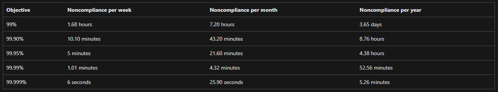
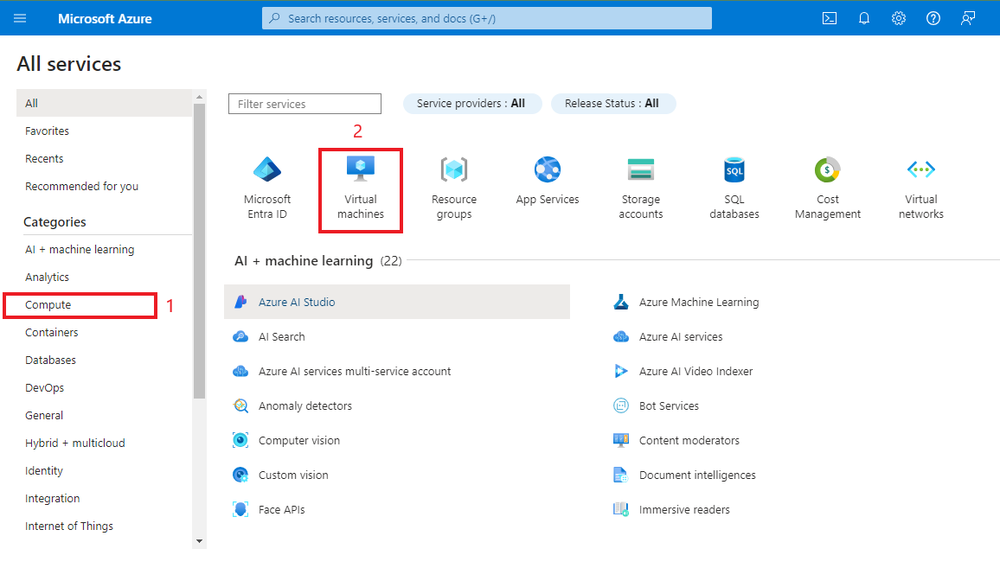

# Resumo sobre SLA (Service Level Agreement)

O SLA (Service Level Agreement ou Acordo de Nível de Serviço) é um contrato entre um provedor de serviços e o cliente, especificando os níveis de desempenho e disponibilidade garantidos para os serviços oferecidos. O SLA é utilizado para definir expectativas claras em relação ao serviço e descrever as penalidades ou compensações caso os níveis acordados não sejam atingidos.

## Níveis de SLA

- **Disponibilidade**: Refere-se ao tempo em que o serviço estará disponível para uso. Geralmente expresso em porcentagem, por exemplo, 99.9%, 99.95%, ou 99.99%. 
- **Desempenho**: Refere-se à velocidade ou capacidade de resposta do serviço sob diferentes condições de uso.
- **Tempo de Resolução**: Descreve o tempo máximo que o provedor levará para resolver problemas ou falhas.

### Como o SLA influencia na escolha de Máquinas Virtuais?

- **Alta Disponibilidade**: Se um SLA exige uma alta disponibilidade, você pode precisar optar por Máquinas Virtuais (VMs) com redundância e replicação geográfica.
- **Resiliência e Tolerância a Falhas**: Para garantir que o SLA seja cumprido em termos de tempo de atividade, você pode precisar configurar VMs em diferentes regiões ou zonas de disponibilidade.
- **Custo**: SLAs mais elevados geralmente vêm com custos mais altos, pois exigem infraestruturas mais robustas e redundantes.
  

---

# Resumo sobre Como Criar uma Máquina Virtual no Azure

Aqui estão os passos básicos para criar uma Máquina Virtual (VM) no Microsoft Azure:

## Passo 1: Acesse o Portal do Azure

1. Vá até o [portal do Azure](https://portal.azure.com).
2. Faça login com suas credenciais da conta Azure.

## Passo 2: Criação da Máquina Virtual

1. No painel principal, clique em **"Criar um recurso"**, ou em **"Todos os serviços"** seguido por **"Computação"**.
2. Selecione **"Máquina Virtual"** na seção de computação.

## Passo 3: Configuração da Máquina Virtual

1. Preencha as informações necessárias como **Nome da VM**, **Região**, **Tamanho da VM**, e **Sistema Operacional**.
2. Escolha o nível de disponibilidade, que pode ser influenciado pelo SLA que você deseja.

## Passo 4: Configurações de Rede

1. Configure a rede virtual e escolha se deseja usar um IP público ou um balanceador de carga.
2. Verifique as configurações de segurança, como as portas a serem abertas.

## Passo 5: Revisão e Criação

1. Revise todas as configurações e clique em **"Revisar e Criar"**.
2. Aguarde a implantação da sua Máquina Virtual.

## Passo 6: Acessar a Máquina Virtual

1. Após a criação, acesse a VM através de SSH (para Linux) ou RDP (para Windows), usando o IP público ou nome DNS fornecido.

