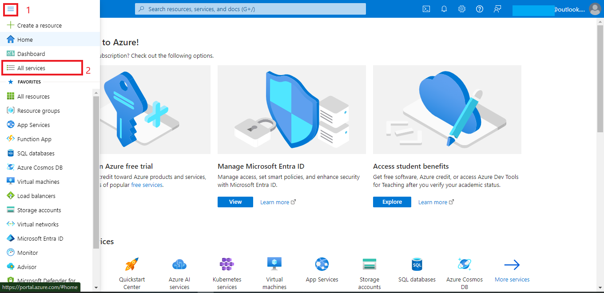
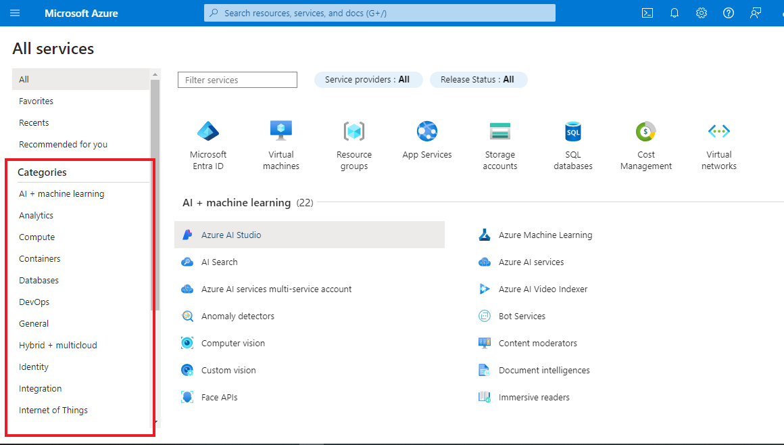
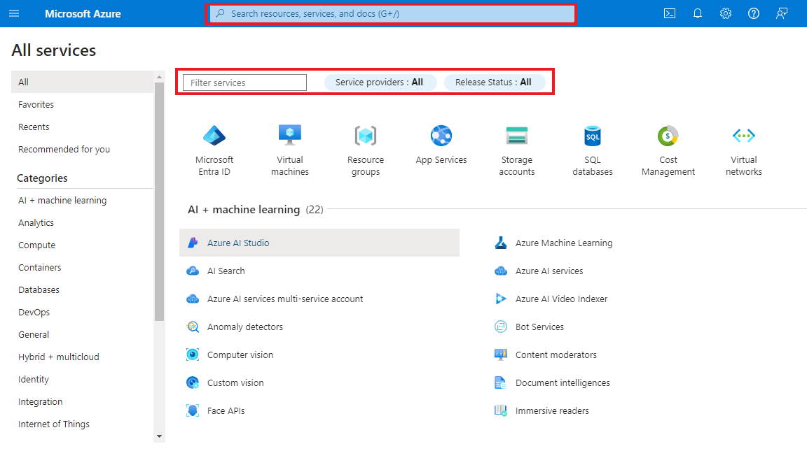

# Localizando Serviços por Categoria no Azure

Neste guia, vamos ver como localizar serviços no Azure por categoria. Seguindo estas etapas, você pode facilmente encontrar os serviços que você precisa na plataforma Azure.

## Passo 1: Acessar o Portal do Azure

Primeiro, acesse o portal do Azure em [https://portal.azure.com](https://portal.azure.com) e faça login com sua conta.

## Passo 2: Navegar para o Menu de Serviços

Após o login, você verá o **Dashboard** do Azure. No canto superior esquerdo, clique no ícone de três linhas para abrir o menu lateral. Em seguida, selecione **Serviços**.

## Passo 3: Explorar as Categorias de Serviços

Dentro da página de serviços, você pode explorar as diferentes categorias de serviços, como **Compute**, **Networking**, **Storage**, e muito mais. Clique na categoria de interesse para visualizar os serviços disponíveis.

## Passo 4: Filtrar por Serviços Específicos

Ao selecionar uma categoria, você poderá filtrar os serviços específicos dentro dessa categoria. Use o campo de busca ou os filtros fornecidos na página para facilitar sua pesquisa.

## Passo 5: Selecionar o Serviço Desejado

Após localizar o serviço que deseja, clique sobre ele para acessar mais detalhes e opções de configuração.

## Conclusão

Seguindo esses passos, você pode facilmente localizar e filtrar serviços por categoria dentro do Azure, facilitando a navegação e a escolha do serviço adequado para suas necessidades.

